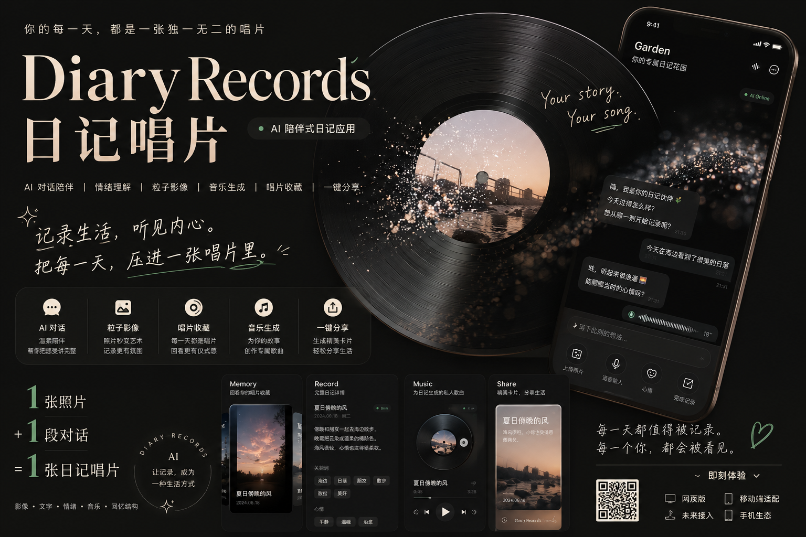
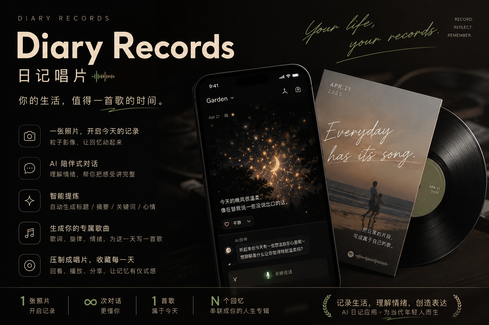
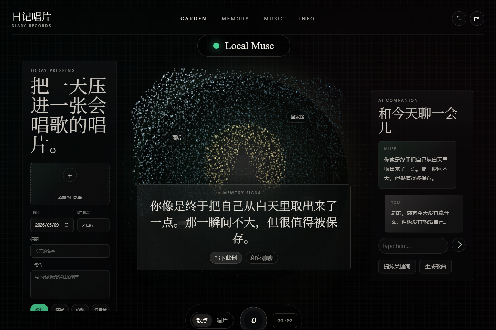
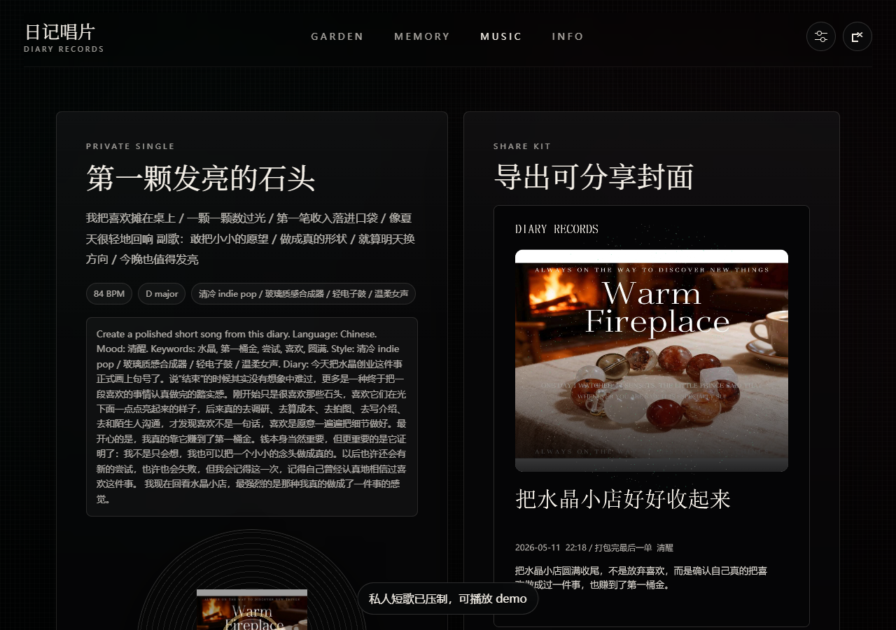
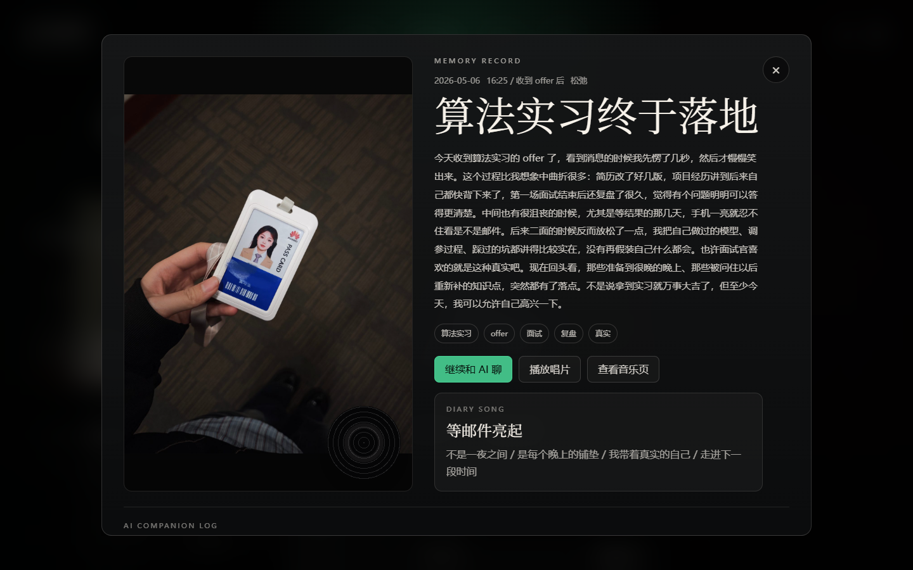

# Diary Records｜日记唱片

> **把一天的照片、情绪、对话和音乐，压制成一张可以回看、可以播放、可以分享的私人唱片。**

Diary Records｜日记唱片 是一个面向手机 AI 体验设计的可运行 AIGC 应用原型。它不只是“帮用户写日记”，而是把照片、陪伴式对话、情绪理解、粒子影像、唱片视觉和私人音乐生成融合在一起，让每一天都成为一张有画面、有情绪、有旋律的日记唱片。

## 作品宣传海报

<p align="center">
  
</p>

<p align="center">
  
</p>


---

## 作品一句话

**一张照片，一段对话，一首歌。**  
Diary Records 将用户的生活片段整理成可听、可看、可分享的个人记忆唱片。

---

## 项目定位

当年轻人的生活越来越多地发生在手机里，AI 助手能不能不只是回答问题，而是帮助用户保存生活、理解情绪、创造表达？

Diary Records 尝试给出一种新的答案：

- 它不是传统的文字日记工具，而是一个 **个人记忆生成器**。
- 它不是普通 AI 聊天窗口，而是一个能围绕当天生活继续追问、总结和创作的 **AI 陪伴入口**。
- 它不是单纯的音乐生成工具，而是把音乐绑定到某一天、某张照片和某段情绪上的 **私人唱片系统**。

产品面向 18–35 岁高频手机用户，适用于学习复盘、工作记录、旅行回忆、宠物日常、情绪整理、社交分享和特殊纪念日记录等场景。

---

## 核心体验

```text
上传一张照片
      ↓
和 AI 轻松聊几句
      ↓
AI 提炼标题、摘要、关键词和心情
      ↓
照片变成粒子影像或唱片视觉
      ↓
根据日记生成歌词、曲风和私人短歌
      ↓
形成一张可以回看、播放、分享的日记唱片
```

---

## 界面预览

### Garden｜创建与陪伴主页

用户可以在这里上传照片、选择心情、输入一句话，也可以与 AI 进行文字或语音对话。中心视觉以粒子影像和唱片为主，弱化表单感，突出“正在创作一张记忆唱片”的体验。



### Music｜私人短歌制作与分享

根据日记内容生成歌曲标题、歌词、副歌、曲风、BPM、调性和音乐 prompt。接入音乐生成模型后，可进一步生成完整音频；当前原型也支持本地 WebAudio demo 播放，保证演示链路完整。



### Memory｜日记唱片翻阅

所有日记以唱片收藏的方式横向翻阅，用户可以像翻看唱片架一样回看过去的记录。每一篇日记都不只是文本，而是一个包含照片、关键词、AI 对话和音乐信息的记忆节点。


### Memory Detail｜历史记录详情

打开任意一张日记唱片后，可以查看完整正文、关键词、心情、歌曲信息和历史 AI 对话，也可以继续补充这段记忆。



---

## 宣传海报

海报采用深色、高级、清冷的 Instagram 风格，以唱片、手机界面、粒子光点和手写字作为主要视觉元素，突出“日记变成唱片”的产品记忆点。


---

## 已实现功能

| 模块 | 已实现能力 | 说明 |
| --- | --- | --- |
| 日记创建 | 日期、时间段、标题、一句话、心情标签 | 支持用户快速创建当天记录 |
| 图片上传 | 上传照片并生成粒子视觉 | 将普通照片转化为可交互的记忆影像 |
| AI 陪伴对话 | 文字对话、语音输入、情绪化追问 | 帮助用户把零散感受讲完整 |
| 日记结构化 | 自动生成标题、摘要、关键词、心情 | 降低写作门槛，让内容更清晰 |
| 唱片视觉 | 粒子视图 / 唱片视图切换 | 建立“压制日记唱片”的产品隐喻 |
| 音乐方案 | 歌曲标题、歌词、副歌、曲风、BPM、调性、prompt | 让日记进一步转化为私人短歌 |
| 本地音频演示 | WebAudio demo 播放 | 音乐模型不可用时也能完整展示流程 |
| Memory 翻阅 | 横向翻阅、打开详情、回看对话、播放唱片 | 让旧日记成为可回访的长期记忆节点 |
| 分享导出 | 生成封面图、复制文案、系统分享 | 适配朋友圈、小红书、Instagram、视频号等分享场景 |
| 生态联动模拟 | 相册、日历、位置、备忘录、运动、音乐等线索设想 | 展示未来作为手机系统级 AI 记忆插件的潜力 |

---

## 为什么做这个作品

### 1. 记录成本高

传统日记要求用户主动组织语言，时间成本和心理门槛都比较高。很多人本来想记录，最后只留下几张照片或几句零散备忘。

### 2. 生活内容太碎片

真实生活散落在相册、聊天记录、日历、地图轨迹、备忘录、音乐、运动健康和社交平台里。单一日记 App 很难还原一天的完整情境。

### 3. 普通 AI 工具缺少情绪温度

很多 AI 总结工具擅长提炼信息，却不擅长接住具体情绪，容易输出模板化安慰。Diary Records 更强调陪伴式追问和温柔整理。

### 4. 分享形态同质化

普通截图、九宫格照片和流水账文字已经很难产生新鲜感。Diary Records 通过唱片、粒子影像、关键词和音乐，让日记更适合社交传播。

### 5. 私人记忆缺少长期组织

用户写完一篇日记后往往很少回看。Memory 页用唱片架和收藏结构组织记忆，让回看本身也具有仪式感。

---

## 设计理念

Diary Records 的核心创新点是：

> **把“记录”从文字任务变成一张可听、可看、可分享的私人唱片。**

产品设计遵循三条原则：

1. **先陪伴，再总结**  
   AI 不以报告式语言替用户下结论，而是通过温柔、具体、克制的追问，帮助用户把感受讲完整。

2. **先美学，再工具**  
   界面不做“工厂式生成平台”，而是让画面、粒子、唱片、翻阅和分享成为体验主角。

3. **先授权，再自动**  
   未来手机生态联动必须建立在用户明确许可和可解释数据线索之上，只整理用户可确认的日记素材。

---

## 大模型应用说明

Diary Records 通过多种大模型能力协同工作，完成从素材理解、情绪陪伴到日记结构化和音乐创作的一体化体验。

| 模块 | 模型能力 | 作用 |
| --- | --- | --- |
| AI 陪伴对话 | 中文对话、长上下文、情绪陪伴 | 与用户自然聊天，追问细节，避免模板化回复 |
| 图片理解 | 多模态视觉语言模型 | 识别照片中的场景、物体、色彩、人物关系和情绪氛围 |
| 日记结构化 | 文本理解、JSON 输出 | 生成标题、摘要、关键词和心情标签 |
| 歌词与音乐方案 | 文本创作模型 | 根据日记生成歌词、副歌、曲风、BPM、调性和 prompt |
| 音乐生成 | Song generation / Music generation / Audio generation 模型 | 输出完整歌曲音频或伴奏 |
| 语音输入 | ASR / Whisper 类模型 | 将用户语音转写成日记素材 |
| 语音回复 | TTS 模型 | 让 AI 陪伴拥有固定声音人格 |
| 端侧整理 | 小模型或系统 AI | 在本地整理手机生态线索，减少隐私风险 |

当前原型采用 **OpenAI-compatible Chat Completions** 接口形式，方便接入不同模型服务，也便于后续替换为其他大模型能力。

---

## 技术实现

当前原型使用轻量级前端技术实现，便于比赛演示、移动端运行和后续迁移。

| 技术点 | 说明 |
| --- | --- |
| HTML / CSS / JavaScript | 不依赖复杂构建流程，打开即可运行 |
| Canvas 粒子系统 | 将照片像素采样为动态点阵，支持鼠标和触摸交互 |
| Web Speech API | 支持浏览器语音输入演示链路 |
| WebAudio | 在音乐模型不可用时生成本地 demo 旋律 |
| OpenAI-compatible API | 支持接入多种大模型服务，降低模型替换成本 |
| localStorage | 保存样例日记和用户创建内容，便于无后端演示 |
| PWA 基础能力 | 支持手机浏览器运行和基础缓存能力 |
| 响应式 UI | 兼容桌面浏览器、手机尺寸和移动端分享场景 |

后续产品化阶段可迁移到 React / Vue + Capacitor / React Native / Flutter，并接入真实账户系统、云同步、音频生成队列和端侧隐私沙盒。

---

## 如何运行

### 方式一：直接打开

在浏览器中打开：

```text
index.html
```

### 方式二：本地服务运行

推荐使用本地服务启动，便于浏览器权限、PWA 缓存和移动端调试。

```bash
python -m http.server 55173 --bind 127.0.0.1
```

然后访问：

```text
http://127.0.0.1:55173/index.html
```

---

## AI API 配置

点击页面右上角设置按钮，可配置 OpenAI-compatible 接口。

| 配置项 | 说明 |
| --- | --- |
| Base URL | 例如 `http://127.0.0.1:4000/v1` |
| API Key | 你的模型服务密钥 |
| Chat / Vision Model | 用于日记对话、摘要、关键词提取和图片理解 |
| Music Model | 用于音乐方案或音乐生成 |

接口形式：

```http
POST /chat/completions
```

如果外部模型暂不可用，原型会自动回退到本地 demo 逻辑，保证主要演示流程可以继续完成。

---

## 推荐演示流程

1. 进入首页 Garden。
2. 上传一张照片，观察粒子影像生成效果。
3. 输入一句当天的感受，选择心情标签。
4. 与 AI 进行几轮陪伴式对话。
5. 生成标题、摘要、关键词和心情。
6. 切换为唱片视觉，查看“日记唱片”效果。
7. 进入 Music 页面，查看歌词、曲风、BPM、调性和播放效果。
8. 进入 Memory 页面，横向翻阅历史日记。
9. 打开某篇旧日记，查看详情、关键词、历史对话和歌曲信息。
10. 生成分享图或复制分享文案。

---

## 项目结构参考

```text
Diary_Records/
├── index.html
├── README.md
├── PROJECT_REPORT.md
├── qa-desktop-v2.png
├── qa-core-music.png
├── qa-core-memory.png
├── qa-memory-detail-v5.png
├── 宣传海报/
│   ├── a_wide_promotional_app_poster_ui_mockup_image_d.png
│   └── a_polished_app_promo_poster_style_image_dark_mo.png
└── ...
```

---

## 典型应用场景

### 学习 / 工作后的低成本复盘

用户结束一天课程、项目、面试或实习后，上传一张照片或直接语音说几句。AI 根据表达继续追问细节，最后生成“今天的标题、摘要、关键词、心情和复盘唱片”。

### 拍照后的情绪化影像日记

用户旅行、通勤、养宠、聚会或散步后，选择一张照片。系统将照片转成粒子视觉，关键词在画面中浮现，用户可以和 AI 聊照片背后的故事。

### 特殊节点的私人纪念

例如第一次创业收尾、第一次养宠物、拿到实习 offer、搬家、毕业、告别一段关系、完成一个项目。产品将这些节点从普通照片变成“可播放的记忆唱片”。

### 手机生态自动生成日记草稿

在用户授权后，系统可以读取有限范围内的相册、日历、位置、备忘录、运动、音乐等线索，先在端侧整理成“今天可能值得记录的素材”，再由用户选择是否生成日记。

---

## 隐私与权限原则

Diary Records 未来如果接入手机生态能力，需要遵守以下原则：

- **明确授权**：每一类数据源都必须由用户单独开启。
- **端侧优先**：能在本地完成的识别、摘要和过滤，优先在端侧完成。
- **只生成线索，不直接定稿**：系统先生成候选日记素材，由用户确认后再进入日记。
- **可删除、可追溯**：用户可以看到每条线索来自哪里，并随时删除。

---

## 后续规划

- 接入真实音乐生成模型，输出完整歌曲音频。
- 接入更强的多模态视觉模型，提高照片理解能力。
- 接入 TTS，让 AI 陪伴拥有固定声音人格。
- 增加年度专辑、月度歌单、主题唱片集。
- 增加情侣、朋友、社团或项目组的共同唱片。
- 增加短视频导出，把粒子动画、关键词和歌曲合成为视频。
- 建立端侧隐私处理层，用本地模型整理手机生态线索。
- 封装为移动 App、快应用或系统级 AI 记忆插件。

---

## 团队信息

**团队名称：** WeAreTheFuture  
**作品名称：** Diary Records｜日记唱片  
**参赛方向：** 2026 年中国高校计算机大赛 AIGC 创新赛  

团队希望通过 Diary Records 探索一种更生活化、更审美化、更有情绪温度的 AI 应用形态：让 AI 不只是回答问题，而是帮助人们保存生活、理解情绪、创造表达。

---

## 相关文档

- [PROJECT_REPORT.md](./PROJECT_REPORT.md)
- [index.html](./index.html)

